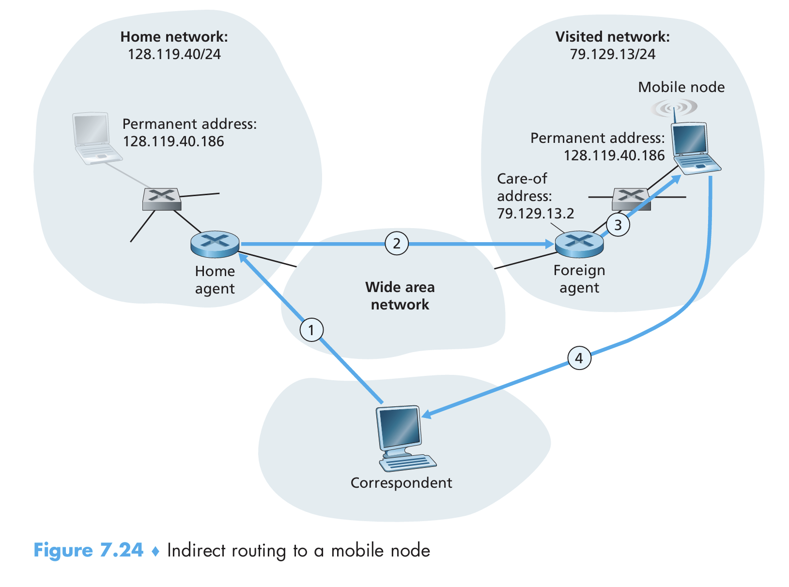

## 7.1 Introduction

We can identify the following elements in a wireless network:

- *Wireless hosts*. Hosts are the end-system devices that run applications.
- *Wireless links*. A host connects to a base station or to another wireless host through a wireless communication link.
- *Base station*. A base station is responsible for sending and receiving data to and from a wireless host that is associated with the base station. **Cell towers** in cellular networks and **access points** in 802.11 wireless LANs are examples of base stations. 

When a mobile host moves beyond the range of one base station and into the range of another, it will change its point of attachment — this process is referred to *handoff*.

## 7.2 Wireless Links

We can find a number of differences between a wired link and a wireless link:

- *Decreasing signal strength*. 
- *Interference from other sources*. Radio sources transmitting in the same frequency band will interfere with each other. 
- *Multipath propagation*. Multipath propagation occurs when portions of the electromagnetic wave reflect off objects and the ground, taking path of different lengths between a sender and a receiver. 

The discussion above suggests that bit errors will be more common in wireless links than in wired links.

Two metrics are important for host receiving the wireless signal. The **signal-to-noise ratio (SNR)** is a relative measure of the strength of the received signal and the noise. The bit error rate (BER) is the probability that a transmitted bit is received in error at the receiver. 

Figure 7.3 illustrates several physical-layer characteristics that are important in understanding higher layer wireless communication protocols:

- *For a given modulation scheme, the higher the SNR, the lower the BER*. 
- *For a given SNR, a modulation scheme with a higher bit transmission rate will have a higher BER*.

**CDMA**

In a CDMA (code division multiple access) protocol, each bit being sent is encoded by multiplying the bit by a signal (the code) that changes at a much faster rate (known as the **chipping rate**) than the original sequence of data. 

The CDMA code used by the sender consists of a sequence of $M$ values $c_m$, with each taking a $+1$ or $-1$ value. 

As shown in Figure 7.5, the output of the CDMA encoder $Z_{i,m}$ is the value of data bit $d_i$ multiplied by the $m$-th bit in the assigned CDMA code $c_m$: 
$$
Z_{i,m} = d_i \cdot c_m
$$
With no interfering senders, the receiver can receive the encoded $Z_{i,m}$ and recover the original data bit $d_i$ by computing: 
$$
d_i=\frac{1}{M}\sum_{m=1}^M Z_{i,m}\cdot c_m
$$
However, CDMA must work in the presence of interfering senders that are encoding and transmitting their data using a different assigned code. 

CDMA can handle this problem under the assumption that the interfering bit signals are additive. That is, the value received during the $m$-th mini-slot of the $i$-th time slot is now the *sum* of the transmitted bits from all $N$ senders:
$$
Z_{i,m}^s = d_i^s\cdot c_m^s\\
Z^*_{i,m} = \sum_{s=1}^N Z_{i,m}^s\\
$$
Amazingly, if the senders' codes are chosen carefully, each receiver can recover the data sent by a given sender out of the aggregate signal simply by using the sender's code in exactly the same manner as before: 
$$
d_i^s=\frac{1}{M}\sum_{m=1}^M Z^*_{i,m}\cdot c_m^s
$$
In linear algebra's perspective, CDMA codes can be viewed as $N$ orthogonal vectors in a $M$-dimension space. Because the dot product of $\vec{c^{s_1}}$ and $\vec{c^{s_2}}$ always gives $0$, different senders actually do not interfere each other.

We see here that CDMA is a partition protocol in that it partitions the code space and assigns each node a dedicated piece of the code space. 

## 7.3 WiFi: 802.11 Wireless LANs 

Although many technologies and standards for wireless LANs were developed in the 1990s, one particular class of standards has clearly emerged as the winner: the IEEE 802.11 wireless LAN, also known as WiFi. 

**The 802.11 Architecture**

The fundamental building block of the 802.11 architecture is the *basic service set (BSS)*. A BSS contains one or more wireless stations and a central base station, known as an *access point (AP)*. 

As with Ethernet devices, each 802.11 wireless station has a 6-byte MAC address that is stored in the firmware of the station's adapter (802.11 network interface card). 

The 802.11 standard requires that an AP periodically send *beacon frames*, each of which includes the AP's SSID and MAC address. Your wireless device, knowing that APs are sending out beacon frames, scans the 11 channels, seeking beacon frames from any APs that may be out there. 

The process of scanning channels and listening for beacon frames is known as *passive scanning*. A wireless device can also perform *active scanning*, by broadcasting a probe frame that will be received by all APs within the wireless device's range.

**The 802.11 MAC Protocol**

Because multiple wireless devices may transmit data at the same time over the same channel, a multiple access protocol is needed to coordinate the transmissions. 

This random access protocol is referred to as *CSMA with collision avoidance*, or more succinctly as *CSMA/CA*. Compared to Ethernet's CSMA/CD protocol, 802.11 uses collision-avoidance techniques. Second, because of the high bit error rates of wireless channels, 802.11 uses a link-layer acknowledgement/retransmission scheme. 

Two important reasons for choosing collision avoidance instead of collision detection: 

- The ability to detect collisions requires to send and receive at the same time. Because the strength of the received signal is much smaller compared to the strength of the transmitted signal at the 802.11 adapter, it is costly to build hardware that can detect a collision. 
- More importantly, the adapter would still not be able to detect all collisions due to the hidden terminal problem and fading. 

Because 802.11 wireless LANs do not use collision detection, once a station begins to transmit a frame, it transmits the frame **in its entirety**. 

Before considering collision avoidance, we'll first need to examine 802.11's link-layer acknowledgement scheme. 

As shown in Figure 7.10, after the destination has received the packet, it waits a short period of time known as *Short Intra-frame Spacing (SIFS)*. 

Suppose a station has a frame to transmit. The CSMA/CA works like this:

1. If initially the station senses the channel is idle, it transmits the frame after a short period of time known as *Distributed Intra-frame Spacing (DIFS)*.

2. Otherwise, it chooses a backoff value using binary exponential backoff and count down this value if the station senses the channel is idle. If the channel is sensed busy, the value remains frozen. 

3. When the counter reaches zero, the station transmits the entire frame immediately and waits for an acknowledgement. 
4. If an acknowledgement is received, the transmission works successfully. Otherwise, it goes back to step 2, with the backoff value chosen from a larger interval. 

Why 802.11 uses collision avoidance? Let's consider a scenario where two stations each have a frame to transmit but neither station can transmit immediately because the channel is busy.

With Ethernet's CSMA/CD, the two stations transmit the frame immediately and cause a collision. However, this is not a serious problem because they both abort the transmission after detect the collision. 

But in 802.11, situation is quite different. Because 802.11 does not detect collision and transmit the frame entirely, which is a huge waste of resources. 

With CSMA/CA, they enter random backoff, hopefully choosing different backoff values. The losing station will hear the winning station's signal, freeze it counter, and start its transmission until the winning station has finished. 

## 7.5 Mobility Management: Principles 

In a network setting, the permanent home of a mobile node is known as the *home network*, and the entity performs the mobility management functions is known as the *home agent*. 

The network in which the mobile node is currently residing is known as *foreign (or visited) network*, and the entity within the foreign network is known as the *foreign agent*. A *correspondent* is the entity wishing to communicate with the mobile node. 

**Addressing**

When a mobile node is resident in a foreign network, all traffic addressed to the node's permanent address now needs to be routed to the foreign network. How can this be done?

One option is for the foreign network to advertise to all other networks that the mobile node is resident in its network. But this approach simply doesn't scale.

An alternative approach (and one that hash been adopted in practice) is to push mobility functionality from the network core to the network edge — a recurring theme in our study of Internet architecture. 

One role of the foreign agent is to create a so-called **care-of address (COA)** for the mobile node, with the network portion of the COA matching that of the foreign network. 

**Indirect Routing to a Mobile Node**

Let's consider a correspondent that wants to send a datagram to a mobile node. In the indirect routing approach, the correspondent simply addresses the datagram to the mobile node's permanent address and sends the datagram into the network. It is unaware of whether the mobile node is resident in its home network or is visiting a foreign network. 

For home agent, it is responsible for interacting with a foreign agent to track the mobile node's COA. Additionally, it keeps track of arriving datagrams addressed to nodes whose home network is that of the home agent but are currently resident in a foreign network. 

The home agent will need to address the datagram using the mobile node's COA, so that the network layer will route the datagram to the foreign network. On the other hand, it is desirable to leave the correspondent's datagram intact. 

Both goals can be done by having the home agent **encapsulate** the correspondent's original complete datagram within a larger datagram. This larger datagram will be forwarded to the mobile node's COA. The foreign agent will receive and decapsulate the datagram.

It's easy for mobile node to send datagrams to correspondent. Since the mobile node knows the correspondent's address, there is node need to route the datagram back through the home agent. 

**Direct Routing to a Mobile Node**

The indirect routing approach illustrated in Figure 7.24 suffers from an inefficiency known as the *triangle routing problem* — datagrams addressed to the mobile node must be routed first to the home agent and then to the foreign network.

In the direct routing approach, a correspondent agent in the correspondent's network first learns the COA of the mobile node. The correspondent agent then tunnels datagrams directly to the mobile node's COA.

While direct routing overcomes the triangle routing problem, it introduces challenges. When the mobile node moves from one foreign network to another, the data should be forwarded to the new foreign network. 

In the case of indirect routing, this problem was easily solved by updating the COA maintained by the home agent. However, with direct routing, the home agent is queried for the COA by the correspondent agent only once.

The solution (in practice) works as follows. We will identify the foreign agent in that foreign network where the mobile node was first found as the *anchor foreign agent*. When the anchor foreign agent receives an encapsulated datagram for a departed mobile node, it can re-encapsulate the datagram and forward it to the mobile node using the new COA. 

## 7.7 Managing Mobility in Cellular Networks

In GSM terminology, the mobile user's home network is referred to as the mobile user's *home public land mobile network (home PLMN)*.

Compared to the mobile IP, the responsibilities of the home and visited networks are quite different: 

- The home network maintains a database known as the *home location register (HLR)*. A special switch in the home network, known as the *Gateway Mobile services Switching Center (GMSC)* is contacted by a correspondent when a call is placed to a mobile user.
- The visited network maintains a database known as the *visitor location register (VLR)*.

**Routing calls to a Mobile User**

The steps in Figure 7.30 are as follows:

1. The correspondent dials the mobile user's phone number. The call is routed from the correspondent through the PSTN to the home MSC in the mobile's home network. 
2. The home MSC receives the call and interrogates the HLR to determine the location of the mobile user. In the simplest case, the HLR returns the *roaming number*. It is temporarily assigned to a mobile when it enters a visited network.  
3. Given the roaming number, the home MSC sets up the second leg of the call through the network to the MSC in the visited network. 